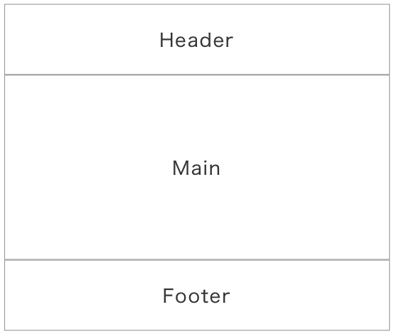

**Keywords**  
SPA, React, Functional Components, FlexBox, SCSS, Responsiveness, react-router-dom

**Arhitectura**
Single Page Application  
Componentele `Header` si `Footer` raman mereu in pagina, in timp ce in Main sunt afisate pe rand componentele `Home`, `Add`, `Get`, `Update` si `Delete`, in functie de ruta. 

#### Layout

**Rutarea**  
Folosesc biblioteca `react-router-dom`.  
Schimbarea rutei (implicit si componentei din Main) se face din Header, care este un navigation bar.

**Header-ul**  
Este responsive pentru ca folosesc FlexBox.  
Desktop 
Tablet 
Mobile 