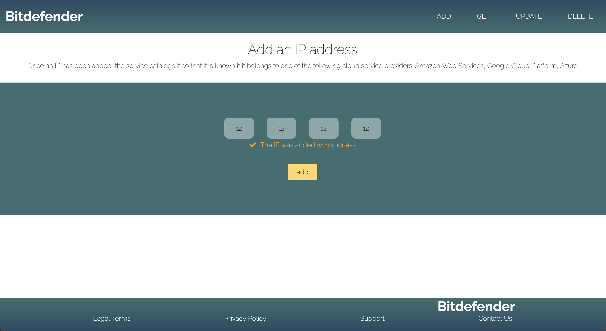
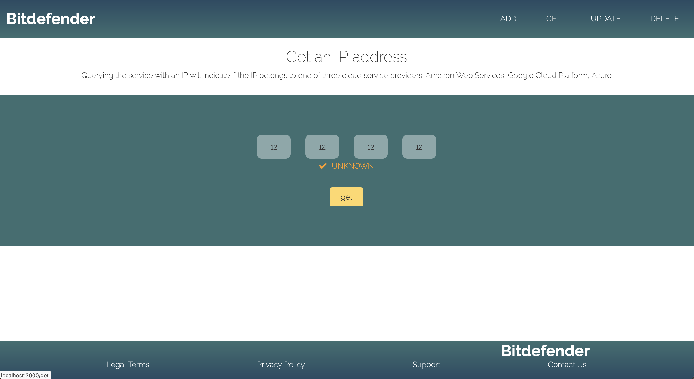
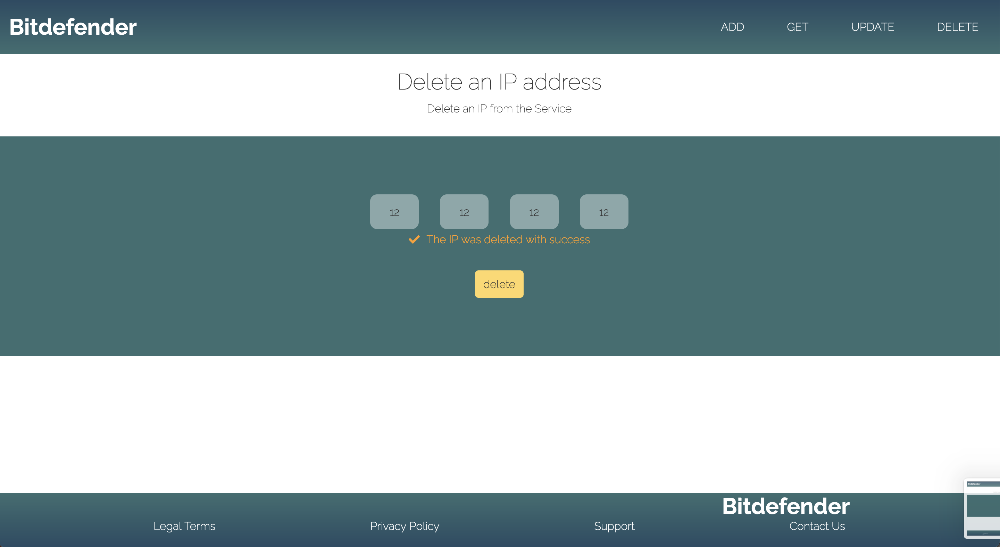

**Keywords**  
SPA, React, hooks, Functional Components, FlexBox, SCSS, Responsiveness, react-router-dom, Media Queries, Sketch, Google Fonts, axios, validator

**Arhitectura**
Single Page Application  
Componentele `Header` si `Footer` raman mereu in pagina, in timp ce in Main sunt afisate pe rand componentele `Home`, `Add`, `Form`, `Update` si `Delete`, in functie de ruta. 

#### Layout

**Rutarea**  
Folosesc biblioteca `react-router-dom`.  
Schimbarea rutei (implicit si componentei din Main) se face din Header, care este un navigation bar.

**Header**  
Este responsive pentru ca folosesc FlexBox.  
Desktop  

Tablet  

Mobile  

**Footer**  
Este responsive pentru ca folosesc FlexBox.  
Desktop  

Tablet  

Mobile  

**Home**  
Componenta de prezentare.  
Pentru responsiveness am folosit media queries, unitati relative si FlexBox.  
Desktop  

Tablet  

Mobile  

**Form**  
Pentru responsiveness am folosit FlexBox si media queries.  
Desktop  

Tablet  

Mobile  

E format din:
* 4 input-uri pentru adresa IP  
* 3 div-uri pentru mesaje:
  * mesaj de informare (de la submit form pana la primirea raspunsului de la server, apare un mesaj de informare in care utilizatorul e rugat sa astepte)
  * mesaj de success (este raspunsul de la server)
  * mesaj de eroare (eroare de la server sau eroare la validarea input-urilor)
* submit button, unde se face request la server

Folosesc biblioteca `axios` pentru requests.  

De ce am folosit `<input type='text'>` si nu `<input type='number>`: pentru design, `<input type='number>` are 2 butoane in interiorul input-ului.  
Validez ca utilizatorul a introdus un numar din intervalul [0 255] la submit, inainte de request, in /src/utils/validator.js  
Pentru validare, folosesc functia `isInt` cu optiuni de min/max din biblioteca `validator`. Nu folosesc functia `isIP` pentru ca am nevoie sa stiu la care input a aparut eroarea, `isIP` intoarce eroare daca vreun input nu e corect.

Foloseste react states:
* `ip` este un string array care retine ip-ul introdus de la tastatura
* `errors` este un string array care retine erorile ip-ului  
`errors[i]` este mesajul de eroare pentru input-ul `ip[i]`, cu `i` de la 0 la 3  
De exemplu, `errors[0] = 'Invalid number'`, daca utilizatorul nu a introdus un numar din intervalul [0, 255] in primul input  

Mesaj de informare  

Mesaj de succes  

Mesaj de eroare  

Serviciile ADD, GET, UPDATE si DELETE sunt grupate in componenta `Form`. Aceasta primeste argument stringul 'add', 'get', 'update' sau 'delete', iar in functie de acesta face request de tip POST, GET, PUT sau respectiv DELETE.  
Add  

Get  

Update  

Delete  

Componenta `Text` afiseaza un header si un paragraf in functie de argumentul primit 'add', 'get', 'update', 'delete', 'home'.  
Pentru centrare si responsiveness am folosit FlexBox.  
Add  

Get  

Update  

Delete  

Home  

**Design**  
Inspirate: [Oh Sierra - Pinterest](https://pin.it/2qvu5Di)  
Paleta de culori: [Coolors](https://coolors.co/353535-3c6e71-ffffff-d9d9d9-284b63)  
Am schitat design-ul aplicatiei web in aplicatia Sketch (vezi /doc_resources/IP%20Service.sketch)